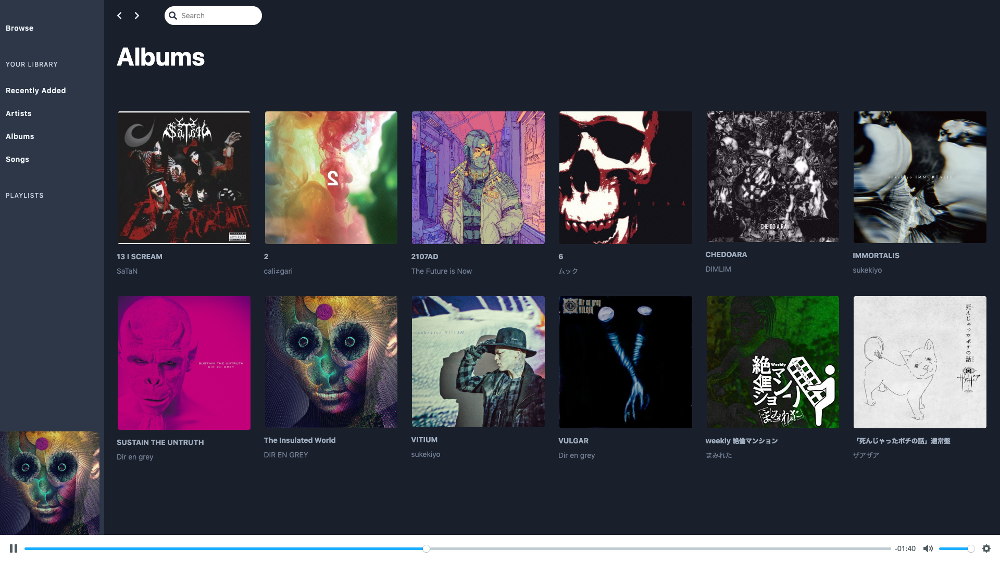

# Axiom Music
**Still in development - not ready to be installed on a production server just yet**

Self-hosted personal music server built using web technologies. Upload your audio, organize your albums, and listen anywhere :v:

    

    

## Technology Stack
- Laravel
- Vue
- Vue Router
- Vuex

## Roadmap
- [ ] Upload media
- [x] Scan media
- [x] Navigate between artists and albums
- [x] Play audio
- [ ] Play queued items
- [ ] Create custom playlists
- [ ] User account(s)
- [ ] Mobile friendly
- [ ] Manage metadata for artists, albums, and songs
- [ ] Installer
- [ ] Configurable media storage (local, s3, etc.)
- [ ] PWA
- [ ] Offline-first

## Installing
1. `composer install`
2. Copy `.env.example` to `.env`
3. Configure database credentials in `.env`
4. `php artisan key:generate`
5. `php artisan migrate`

## Media
To add media to your library, add files to your `storage/uploads` directory. Then run `php artisan music:scan`. The scan command will find supported media, extract metadata information, and rename/copy the files to the `storage/media` directory.